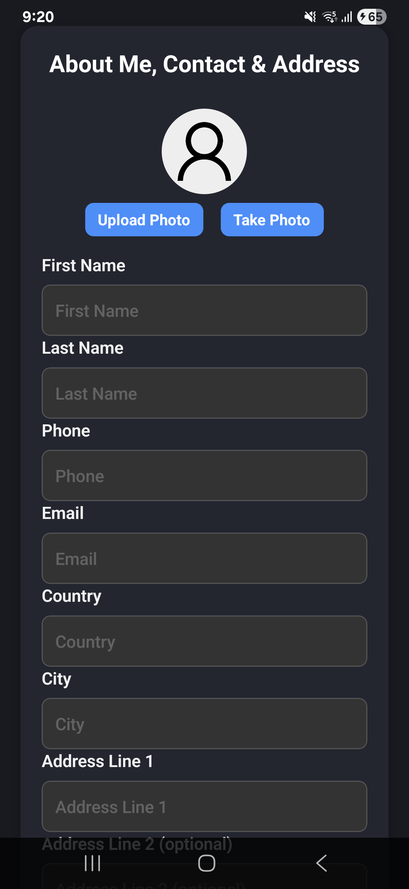
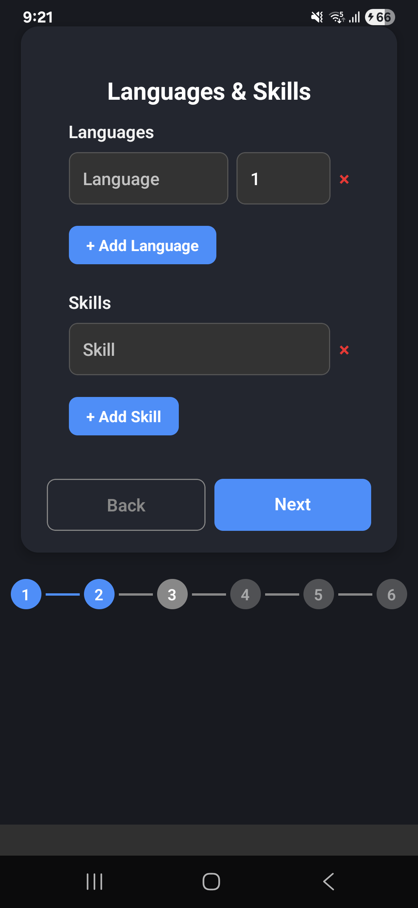
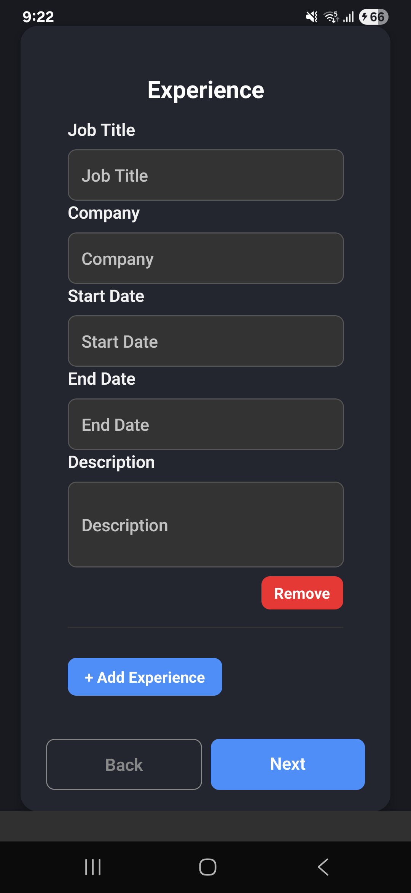
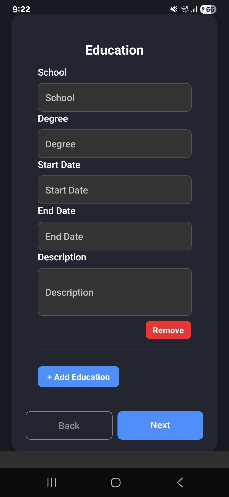
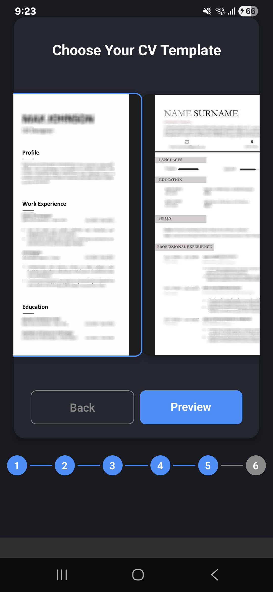
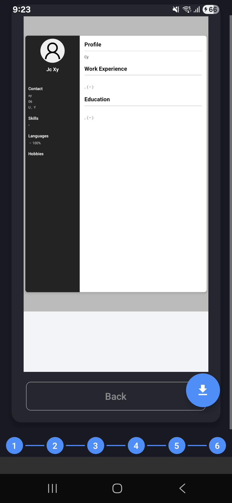

# CV Builder App

A React Native application to help users create professional CVs. Users can enter their information for each section (About Me, Experience, Education, Skills, etc.), upload a profile photo, select a template, and generate a downloadable PDF of their CV.

## Features

- Step-by-step wizard for all essential CV sections:
  - About Me, Contact & Address
  - Languages & Skills
  - Experience
  - Education
  - Template selection
  - Preview
- Upload or capture a profile photo
- Choose from multiple modern CV templates
- Live preview before exporting
- Generate and download a PDF version of your CV (using `react-native-html-to-pdf`)
- Clean, modern, and responsive UI

## Visual Walkthrough

### 1. About Me, Contact & Address
Enter your personal details, contact information, and address. You can also upload or take a profile photo to personalize your CV.



### 2. Languages & Skills
Add the languages you speak and your key skills. You can specify proficiency levels for each language.



### 3. Experience
List your work experience, including job title, company, duration, and a description of your responsibilities and achievements.



### 4. Education
Add your educational background, including school, degree, dates, and a description of your studies or accomplishments.



### 5. Template Selection
Choose a CV template from the available options. Each template offers a different style for your final CV.



### 6. Preview
Review your completed CV in the selected template. Make any final edits if needed.



### 7. Export to PDF
Once you are satisfied with your CV, click the **Download** button to export and save your CV as a PDF file. The PDF will be generated using your selected template and all the information you provided.

---

## User Flow

1. **About Me**: Enter your personal details and upload or take a profile photo.
2. **Languages & Skills**: Add languages you speak and your key skills.
3. **Experience**: List your work experience, including job descriptions.
4. **Education**: Add your educational background.
5. **Template**: Select a CV template from the available options.
6. **Preview**: Review your CV and make any final edits.
7. **Export**: Download your CV as a PDF file.

## Prerequisites

- **Node.js** ≥ 14
- **Yarn** or **npm**
- **Java JDK** & **Android Studio** (for Android)
- **Xcode** & **CocoaPods** (for iOS)
- **React Native CLI** installed globally

## How to Run

1. Install dependencies:
   ```sh
   yarn install
   # or
   npm install
   ```
2. Run on Android:
   ```sh
   npx react-native run-android
   ```
3. Run on iOS:
   ```sh
   npx react-native run-ios
   ```

---

More features and setup instructions coming soon!
